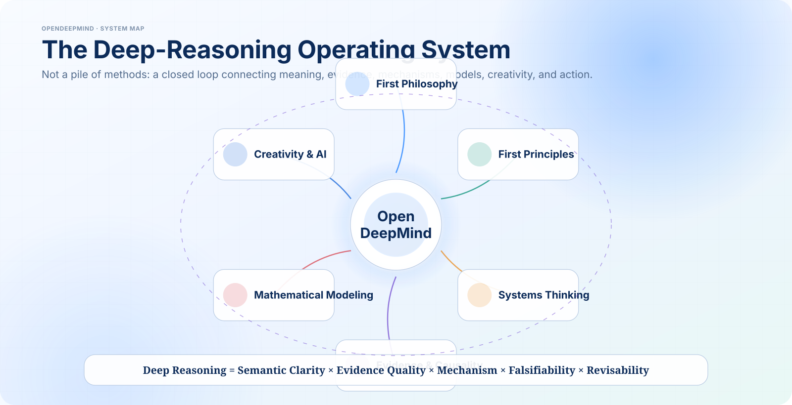
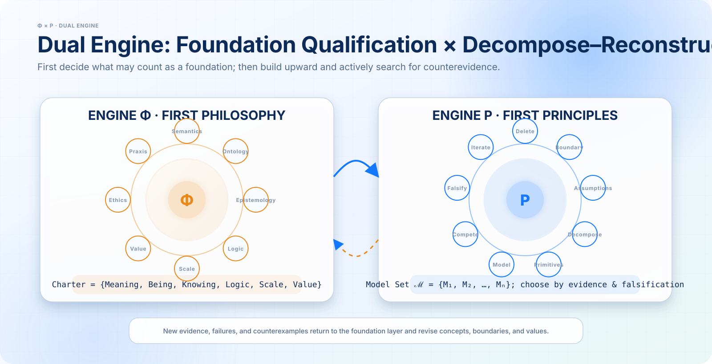
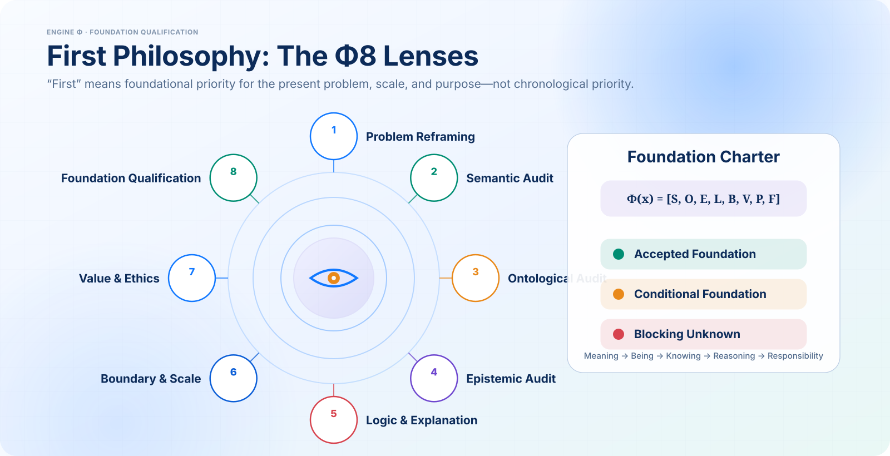
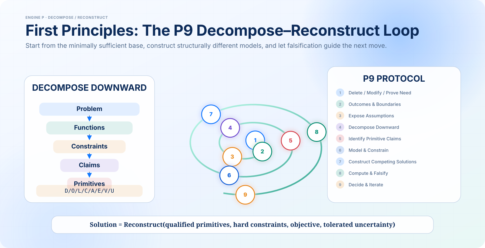
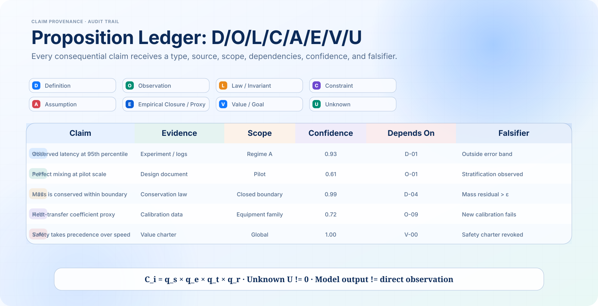
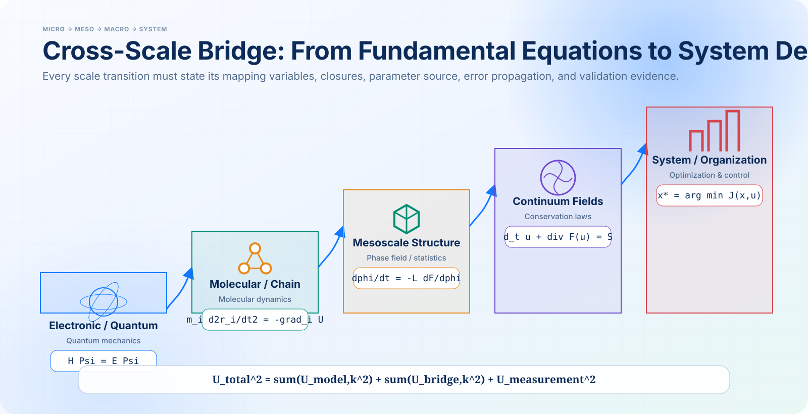
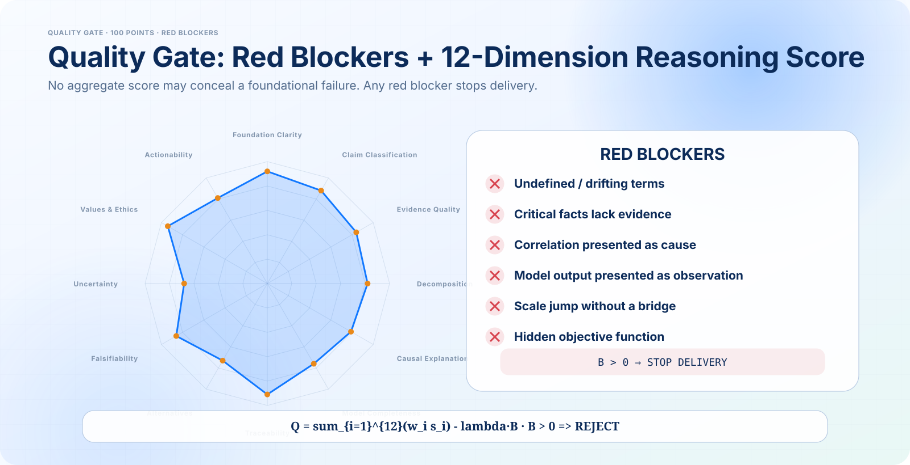

<p align="center">
  
</p>
<p align="center"><sub><b>中英双语首页总览 / Bilingual homepage overview</b> · 第一哲学 × First Philosophy · 第一性原理 × First Principles · 跨尺度建模 × Quality Gates</sub></p>

<h1 align="center">OpenDeepMind_skill</h1>

<p align="center"><b>Do not optimize the inherited frame.<br>Qualify the foundation, derive upward, test the result, and keep the decision revisable.</b></p>

<p align="center">
  <a href="README.zh-CN.md">简体中文</a> ·
  <a href="open-deep-mind/SKILL.md">Skill</a> ·
  <a href="open-deep-mind/FIRST_PHILOSOPHY.md">First Philosophy</a> ·
  <a href="open-deep-mind/FIRST_PRINCIPLES.md">First Principles</a>
</p>

<p align="center">
  
  
  
  
  
  
</p>

> **Independent project.** OpenDeepMind_skill is not affiliated with or endorsed by Google DeepMind. The repository name refers to an open methodology for deep, auditable reasoning.

> **Bilingual homepage.** The repository homepage uses one integrated Chinese–English system overview. Detailed sections retain language-specific diagrams for readability and deterministic mathematical typesetting.

---

## Why this exists

Most “first-principles” prompts begin too late. They decompose a problem without first checking:

- whether the problem is coherently framed;
- whether its central terms refer to the same things;
- whether a fact is actually an assumption, closure relation, or value;
- whether a causal claim is identifiable;
- whether the reasoning crosses scales without a bridge;
- whether “optimal” hides an objective selected by someone.

OpenDeepMind introduces a prior gate:

\[
\boxed{
\text{First Philosophy}
\rightarrow
\text{First Principles}
\rightarrow
\text{Counter-model}
\rightarrow
\text{Quality Gate}
\rightarrow
\text{Action and Revision}
}
\]

It is not a philosophy encyclopedia and not a brainstorming toy. It is a portable procedure for turning ambiguous, consequential questions into **typed claims, explicit foundations, competing models, falsifiable reasoning, and actionable decisions**.

<p align="center">
  
</p>

<p align="center"><sub>English-localized AI-designed visual. Mathematical notation and labels are rendered deterministically for accuracy; the composition is conceptual rather than a literal file tree.</sub></p>

---

## The dual engine

<p align="center">
  
</p>

### Engine Φ — First Philosophy / 第一哲学

The first engine asks:

> **What may legitimately count as a foundation for this inquiry?**

It audits eight dimensions:

\[
\mathcal F_{\Phi}
=
\{\text{semantics},\text{ontology},\text{epistemology},\text{logic},
\text{causality},\text{boundary},\text{value},\text{praxis}\}
\]

Its deliverable is a **Foundation Charter**: definitions, ontology, evidence status, logic, explanatory commitments, scale, values, stakeholders, and unresolved blockers.

<p align="center">
  
</p>

The file is deliberately separate:

[`open-deep-mind/FIRST_PHILOSOPHY.md`](open-deep-mind/FIRST_PHILOSOPHY.md)

It includes executable forms of conceptual analysis, Aristotelian explanation, Cartesian doubt, Kantian conditions-of-possibility analysis, phenomenological reduction, hermeneutic iteration, ethical-first analysis, and naturalized/pragmatic audit.

### Engine P — First Principles / 第一性原理

The second engine asks:

> **What follows if these foundations are accepted within the stated domain, scale, purpose, and conditions?**

Its P9 process is:

1. delete or justify the requirement;
2. define the actual outcome and boundary;
3. expose and type assumptions;
4. decompose dependencies;
5. qualify ground truths;
6. build the model;
7. reconstruct alternatives;
8. derive and falsify;
9. decide, monitor, and update.

<p align="center">
  
</p>

The file is deliberately separate:

[`open-deep-mind/FIRST_PRINCIPLES.md`](open-deep-mind/FIRST_PRINCIPLES.md)

This separation prevents two common errors:

- treating “the deepest available physical theory” as the answer to every philosophical or normative question;
- debating foundations indefinitely without reconstructing a testable model or decision.

---

## The proposition ledger

OpenDeepMind refuses to let unlike claims borrow one another’s authority.

<p align="center">
  
</p>

| Code | Type | Typical evidence or justification |
|---|---|---|
| `D` | Definition | stipulated, lexical, operational, or theoretical |
| `O` | Observation | measurement, record, direct source |
| `L` | Law / invariant | independently supported within a domain |
| `C` | Constraint | physical, logical, legal, ethical, or verified resource boundary |
| `A` | Assumption | adopted premise that remains testable or sensitivity-audited |
| `E` | Empirical closure / estimate | fit, proxy, heuristic, constitutive relation, learned approximation |
| `V` | Value | goal, duty, preference, utility, risk tolerance |
| `U` | Unknown | unresolved item capable of changing the decision |

Every load-bearing claim also receives:

```text
status · scope · source · dependencies · confidence · falsifier · owner · review date
```

Templates:

- [`claim-ledger-template.md`](open-deep-mind/assets/claim-ledger-template.md)
- [`claim-ledger.schema.json`](open-deep-mind/assets/claim-ledger.schema.json)
- [`example-ledger.json`](open-deep-mind/assets/example-ledger.json)

---

## “First” is relative to a level

A principle can be foundational for one model and derived in another.

<p align="center">
  
</p>

A cross-scale arrow is never free:

\[
\text{lower-scale state}
\xrightarrow[\text{uncertainty}]{\text{mapping + closure}}
\text{effective variables}
\xrightarrow[\text{validation}]{\text{higher-scale model}}
\text{observable outcome}
\]

Every bridge must state:

- mapping variables;
- closure or coarse-graining assumption;
- information lost;
- parameter/calibration source;
- uncertainty propagation;
- validation domain;
- failure condition.

This makes the skill usable for conceptual work, formal proof, causal inference, computational science, engineering, strategy, and policy without pretending that they share one evidence standard.

---

## Domain routing

The same core grammar is routed differently:

| Domain | Default emphasis |
|---|---|
| Science and research | measurement, mechanism, rival models, prospective tests |
| Engineering and software | functions, hard constraints, failure, operability, reversibility |
| Quantitative modeling | equations, closures, parameters, IC/BC, convergence, UQ |
| Business and strategy | value mechanism, economics, competitor response, real options |
| Policy, law, and ethics | authority, rights, evidence, distribution, appeal, sunset |
| Personal decisions | values, observed behavior, reversible experiments, review triggers |
| Creative/product innovation | tension, contradiction, structural novelty, usefulness, proof of value |

Full router: [`domain-routing.md`](open-deep-mind/references/domain-routing.md)

Cross-domain rule:

> **The strictest active evidence, safety, and ethical standard governs the shared decision.**

---

## Method selection, not method accumulation

The [`method-atlas.md`](open-deep-mind/references/method-atlas.md) contains more than thirty executable method cards grouped into:

- foundation methods;
- structural methods;
- construction methods;
- adversarial methods;
- calibration methods.

A default complex-problem bundle is:

\[
\text{conceptual audit}
+
\text{causal/mechanism map}
+
\text{morphological construction}
+
\text{inversion}
+
\text{evidence calibration}
\]

Methods rotate only when a specific weak link is identified. Repeating the same criticism with more words does not count as recursion.

---

## Quality gate

<p align="center">
  
</p>

The evaluation system has two layers.

### Layer 1 — red blockers

Examples:

- undefined load-bearing term;
- unsupported key fact;
- invalid inference;
- causal overclaim;
- hidden value function;
- unbridged scale jump;
- missing falsifier or serious rival;
- unsafe deletion of law, safety, or ethical protection;
- fabricated source, datum, or experiment.

A numerical score cannot override a red blocker.

### Layer 2 — 100-point reasoning score

Twelve weighted dimensions assess:

- foundation clarity;
- proposition classification;
- evidence;
- decomposition;
- causal/explanatory adequacy;
- model completeness;
- traceability;
- alternatives;
- falsifiability;
- uncertainty/robustness;
- values/ethics;
- actionability.

Thresholds:

| Mode | Minimum | Condition |
|---|---:|---|
| Rapid | 70 | reversible decision, no red blocker |
| Standard | 80 | no red blocker, one strong rival |
| Deep | 88 | source and uncertainty audit |
| Research/high-stakes | 90 | reproducibility or professional verification as applicable |

Full rubric: [`quality-gates.md`](open-deep-mind/references/quality-gates.md)

---

## Failure-mode radar

OpenDeepMind actively tests for:

- category mistakes and reification;
- false dichotomies and circularity;
- source laundering and citation theater;
- correlation–causation errors;
- mechanism-by-naming;
- model-output realism;
- scale teleportation;
- equation and precision theater;
- proxy optimization;
- hidden normativity;
- deletion fetish;
- irreversible downside;
- responsibility gaps.

Diagnostic catalog: [`failure-modes.md`](open-deep-mind/references/failure-modes.md)

---

## Output architecture

Available formats include:

- Foundation Charter;
- First Principles Decision Memo;
- full Dual-Engine Analysis;
- Scientific Mechanism Audit;
- Engineering Architecture Review;
- Strategy/Policy Memo;
- Rapid Response;
- quality and convergence appendix.

Templates: [`output-templates.md`](open-deep-mind/assets/output-templates.md)

Every substantive output ends with:

```text
Decision / conclusion:
Why:
Trace to foundations:
Key assumptions:
Uncertainty:
What would change the conclusion:
Next discriminating action:
Review trigger:
```

---

## Repository structure

```text
OpenDeepMind_skill/
├── README.md
├── README.zh-CN.md
├── AGENTS.md
├── CONTRIBUTING.md
├── CHANGELOG.md
├── LICENSE.md
├── NOTICE.md
├── .github/
│   └── workflows/
│       └── validate.yml
└── open-deep-mind/
    ├── SKILL.md
    ├── FIRST_PHILOSOPHY.md
    ├── FIRST_PRINCIPLES.md
    ├── references/
    │   ├── method-atlas.md
    │   ├── domain-routing.md
    │   ├── quality-gates.md
    │   ├── failure-modes.md
    │   ├── intellectual-lineage.md
    │   ├── glossary.md
    │   └── worked-examples.md
    ├── assets/
    │   ├── output-templates.md
    │   ├── claim-ledger-template.md
    │   ├── claim-ledger.schema.json
    │   ├── example-ledger.json
    │   └── diagrams/
    │       ├── homepage-bilingual.webp  # bilingual repository hero
    │       ├── en/                     # English AI-designed, formula-rich SVG diagrams
    │       └── zh/                     # Chinese AI-designed, formula-rich SVG diagrams
    └── scripts/
        ├── validate_repository.py
        └── validate_ledger.py
```

The structure follows the open Agent Skills pattern: a concise activation file plus on-demand references, scripts, and assets.

---

## Installation

### Skills CLI

```bash
npx skills add SUNHAOJUN22/OpenDeepMind_skill --skill open-deep-mind
```

### Manual installation

Clone the repository:

```bash
git clone https://github.com/SUNHAOJUN22/OpenDeepMind_skill.git
```

Then copy `open-deep-mind/` into the skills directory supported by the agent runtime. Common project-level locations include:

```text
.codex/skills/
.claude/skills/
.cursor/skills/
.github/skills/
.gemini/skills/
.agent/skills/
```

Client paths evolve; use the current documentation of the target runtime when its convention differs.

### Direct use

An agent that can read files can be instructed:

```text
Read open-deep-mind/SKILL.md.
Apply the dual-engine mode to this question.
Use FIRST_PHILOSOPHY.md before FIRST_PRINCIPLES.md.
Return the Foundation Charter, claim ledger, rival model,
quality gate, recommendation, falsifier, and review trigger.
```

Chinese trigger:

```text
调用 open-deep-mind，使用“第一哲学 → 第一性原理”双引擎深度模式。
先审查定义、本体、证据、因果、边界和价值，再拆解至基底命题并向上重构。
输出基础章程、命题账本、竞争模型、质量门、结论、证伪条件与复审触发器。
```

---

## Example prompts

```text
Analyze whether we should build this architecture from first principles.
Do not accept the stated requirements until they pass the foundation audit.
```

```text
What does “intelligence” mean in this project?
Run First Philosophy mode and show the competing ontologies and evidence standards.
```

```text
Audit this scientific mechanism claim.
Separate direct evidence, model output, assumptions, closure relations, and scale bridges.
```

```text
Rebuild this strategy from first principles.
Include the no-action baseline, competitor response, real options, and falsifiers.
```

```text
用 OpenDeepMind 双引擎审查这项科研结论：
哪些属于观测、规律、假设、经验闭合、价值判断和未知项？
结论跨越了哪些尺度？每个尺度桥如何验证？
```

Worked cases: [`worked-examples.md`](open-deep-mind/references/worked-examples.md)

---

## Validation

No third-party Python package is required.

```bash
python open-deep-mind/scripts/validate_repository.py .
python open-deep-mind/scripts/validate_ledger.py \
  open-deep-mind/assets/example-ledger.json
```

The validator checks:

- Agent Skills frontmatter;
- required separation of the two core files;
- relative links;
- JSON syntax;
- SVG validity;
- Python syntax;
- unresolved blocker tokens;
- presence of the visual system.

GitHub Actions runs the same checks on pushes and pull requests.

---

## Design principles

1. **Foundation before solution.**
2. **Relative, explicit firstness.**
3. **Typed claims before inference.**
4. **Mechanisms and constraints before labels.**
5. **Alternatives before recommendation.**
6. **Falsifiers before confidence.**
7. **Values before optimization.**
8. **Scale bridges before macro claims.**
9. **Action with review triggers, not permanent certainty.**
10. **Progressive disclosure, not context overload.**

---

## Intellectual lineage and attribution

The conceptual source map is documented in [`intellectual-lineage.md`](open-deep-mind/references/intellectual-lineage.md).

Repository architecture was informed by:

- `danyuchn/first-principles-skill` under the MIT License, particularly its explicit requirement-deletion stage;
- `smixs/creative-director-skill` under CC BY 4.0, particularly its phase router, method selection, recursive evaluation, output discipline, and visual README approach;
- the open Agent Skills specification.

OpenDeepMind's dual-engine architecture, Foundation Charter, proposition ledger, strictness ladder, cross-scale audit, quality system, diagrams, scripts, examples, and text are newly authored. See [`NOTICE.md`](NOTICE.md).

---

## License

- code, scripts, schemas, and workflows: Apache-2.0;
- methodology, documentation, and visual assets: CC BY 4.0.

See [`LICENSE.md`](LICENSE.md).

---

## Status

**Version 1.0.0 — initial universal methodology build.**

The project is designed to remain falsifiable and revisable. A future version should change a rule only when it records:

- the failed assumption;
- the evidence or use case that exposed it;
- the changed method;
- the expected improvement;
- the compatibility effect.
