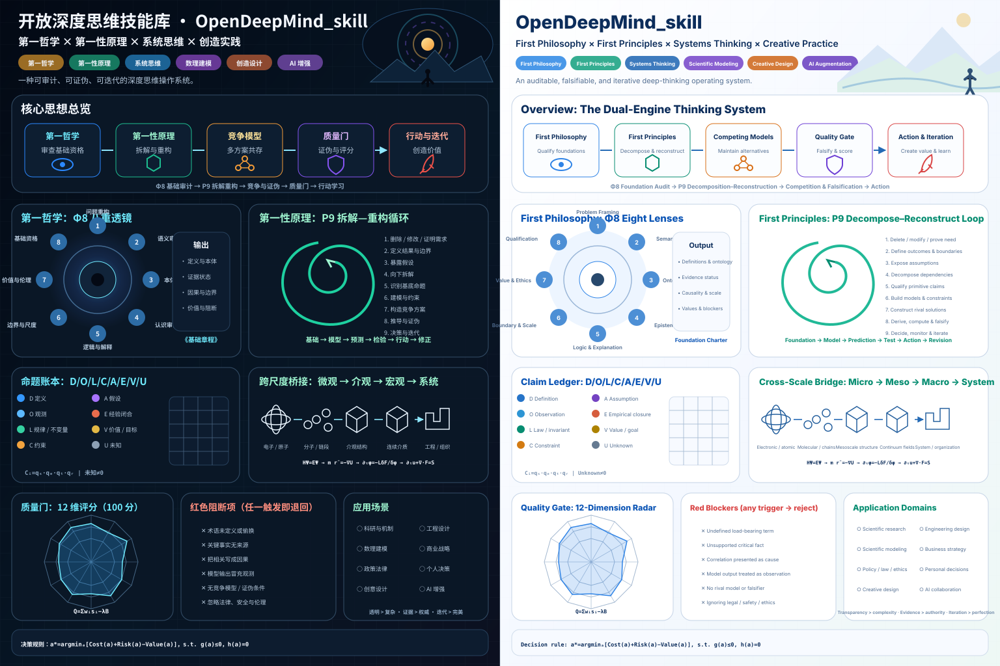

<p align="center">
  
</p>

<h1 align="center">OpenDeepMind_skill</h1>

<p align="center">
  <strong>用第一哲学审查基础，用第一性原理重构方案。</strong><br>
  <strong>Qualify foundations with First Philosophy. Reconstruct solutions with First Principles.</strong>
</p>

<p align="center">
  <a href="open-deep-mind/SKILL.md">Agent Skill</a> ·
  <a href="open-deep-mind/FIRST_PHILOSOPHY.md">第一哲学 / First Philosophy</a> ·
  <a href="open-deep-mind/FIRST_PRINCIPLES.md">第一性原理 / First Principles</a> ·
  <a href="open-deep-mind/TRIZ_ENGINEERING.md">TRIZ（可选） / Optional TRIZ</a> ·
  <a href="open-deep-mind/references/method-atlas.md">方法图谱 / Method Atlas</a> ·
  <a href="open-deep-mind/references/worked-examples.md">案例 / Cases</a>
</p>

<p align="center">
  
  
  
  
  
  
  
</p>

---

## 项目定位 / Positioning

**OpenDeepMind_skill** 是一套面向复杂问题与重大决策的双引擎思维系统。它不把“第一性原理”当作一句从零思考的口号，而是先解决一个更基础的问题：

> **什么有资格成为当前研究、设计或决策的基础？**

完成基础资格审查后，系统才从通过审查的定义、事实、规律、约束、假设、经验闭合、价值和未知项出发，构造竞争模型，进行推导、计算、证伪与决策。

OpenDeepMind_skill is a dual-engine reasoning system for complex inquiry and consequential decisions. It first qualifies what may legitimately count as a foundation, then decomposes and reconstructs the problem from explicit claims, constraints, evidence, assumptions, values, and unknowns.

```math
\boxed{
\text{First Philosophy}
\rightarrow
\text{First Principles}
\rightarrow
\text{Competing Models}
\rightarrow
\text{Falsification and Quality Gates}
\rightarrow
\text{Action and Revision}
}
```

它适用于：科研论证、机理分析、数理建模、工程设计、软件架构、商业战略、政策伦理、个人决策、创意设计与 AI 协作。

TRIZ 不是第三个基础引擎，而是一个**独立、可选、显式调用**的工程发明模块。未明确调用 TRIZ 时，系统继续使用常规 `Φ → P` 路由。

---

## 双引擎架构 / Dual-Engine Architecture

| 引擎 / Engine | 核心问题 / Core question | 主要输出 / Primary output |
|---|---|---|
| **Φ：第一哲学 / First Philosophy** | 什么可以作为基础？概念、对象、证据、因果、边界和价值是否清楚？ | 《基础章程》、概念定义、本体图、证据状态、尺度边界、价值与阻断项 |
| **P：第一性原理 / First Principles** | 在明确的领域、尺度、目的和条件下，从这些基础能够推出什么？ | 基底命题、约束模型、竞争方案、推导链、证伪条件、决策与复审触发器 |

### Φ8：第一哲学八阶段 / Eight foundation audits

1. 问题重构 / Problem framing  
2. 语义审计 / Semantic audit  
3. 本体审计 / Ontological audit  
4. 认识论审计 / Epistemic audit  
5. 逻辑、因果与解释审计 / Logic, causality and explanation  
6. 边界、尺度与时间审计 / Boundary, scale and time  
7. 价值、伦理与利益相关者审计 / Values, ethics and stakeholders  
8. 基础资格判定 / Foundation qualification  

详见 [`FIRST_PHILOSOPHY.md`](open-deep-mind/FIRST_PHILOSOPHY.md)。

### P9：第一性原理九阶段 / Nine decomposition–reconstruction stages

1. 删除、修改或证明需求合理；
2. 定义真实结果与系统边界；
3. 暴露并分类所有假设；
4. 沿依赖关系向下拆解；
5. 识别并审查基底命题；
6. 建立约束、因果、动态或数理模型；
7. 从基础向上构造结构不同的方案；
8. 推导、计算、竞争模型与证伪；
9. 决策、监测、复审与更新。

详见 [`FIRST_PRINCIPLES.md`](open-deep-mind/FIRST_PRINCIPLES.md)。

### T10：可选 TRIZ 工程发明模块 / Optional TRIZ Engineering Module

TRIZ 与第一性原理文件严格分开：

```text
默认：Φ → P → 竞争模型 → 质量门
显式 TRIZ：Φ/P 资格审查 → T 发明构造 → P 物理与证据验证 → 质量门
```

只有在用户明确提出 `TRIZ`、`ARIZ`、矛盾矩阵、40 个发明原理、物理矛盾、Su-Field、IFR 或技术系统进化分析时，才加载 [`TRIZ_ENGINEERING.md`](open-deep-mind/TRIZ_ENGINEERING.md)。

该模块包括：

- 功能、关键缺点和因果链识别；
- 技术矛盾与物理矛盾；
- 理想性和理想最终结果；
- 39 个典型工程参数与 40 个发明原理；
- 时间、空间、条件和系统层级分离；
- Su-Field 与标准解类别；
- ARIZ-85C 深度路线；
- S 曲线和工程系统进化；
- 概念理想性、风险与判别验证。

**默认不调用规则：**仅仅发现“权衡”或日常语言中的“矛盾”，不构成运行 TRIZ 的授权。系统可以提示一次该模块可用，但不会静默执行。

---

## 命题账本 / Claim Ledger

OpenDeepMind 不允许不同类型的命题互相借用权威。所有承重命题必须进入账本：

```math
\mathcal{B}=\{D,O,L,C,A,E,V,U\}
```

| 编码 | 类型 | 含义 | 典型依据 |
|---|---|---|---|
| `D` | Definition / 定义 | 术语的约定、操作性或理论定义 | 定义域、测量方法、理论语境 |
| `O` | Observation / 观测 | 测量、记录或直接来源 | 原始数据、实验记录、正式文件 |
| `L` | Law / invariant / 规律 | 在特定领域和范围内得到支持的规律或不变量 | 理论、重复实验、守恒与对称性 |
| `C` | Constraint / 约束 | 物理、逻辑、资源、法律、安全或伦理边界 | 硬约束与经核验的限制 |
| `A` | Assumption / 假设 | 尚未被确立为事实的前提 | 敏感性分析、替代假设、检验 |
| `E` | Empirical closure / 经验闭合 | 拟合、本构关系、代理变量、启发式或学习型近似 | 标定数据、适用域、误差模型 |
| `V` | Value / 价值 | 目标、义务、偏好、效用与风险容忍度 | 利益相关者与目标函数 |
| `U` | Unknown / 未知 | 足以改变结论但尚未解决的问题 | 不确定性、待判别证据、复审条件 |

每项关键命题还需记录：

```text
status · scope · source · dependencies · confidence · falsifier · owner · review date
```

可直接使用：

- [`claim-ledger-template.md`](open-deep-mind/assets/claim-ledger-template.md)
- [`claim-ledger.schema.json`](open-deep-mind/assets/claim-ledger.schema.json)
- [`example-ledger.json`](open-deep-mind/assets/example-ledger.json)

---

## “第一”是相对层级 / Firstness Is Level-Relative

某个原理可以是一个模型的基础，同时又是另一套更低层理论的推导结果。任何跨尺度结论都必须声明映射、闭合、信息损失、参数来源、不确定性和验证域。

```math
x_{\mathrm{low}}
\xrightarrow[\text{uncertainty}]{\text{mapping + closure}}
z_{\mathrm{effective}}
\xrightarrow[\text{validation}]{\text{higher-scale model}}
y_{\mathrm{observable}}
```

典型跨尺度链：

```math
\hat H\Psi=E\Psi
\rightarrow
m_i\ddot{\mathbf r}_i=-\nabla_i U
\rightarrow
\frac{\partial\phi}{\partial t}=-L\frac{\delta\mathcal F}{\delta\phi}
\rightarrow
\frac{\partial u}{\partial t}+\nabla\cdot F(u)=S
\rightarrow
x^{*}=\arg\min J(x,u)
```

这条链不是自动成立的。每个箭头都必须具有独立的尺度桥与验证证据。

---

## 竞争模型与证伪 / Competing Models and Falsification

系统不允许只构造一个看似合理的故事。标准模式至少保留：

- 当前主模型；
- 一个结构不同的严肃竞争模型；
- 不采取行动的基线；
- 能够区分模型的观测、实验或现实事件。

模型选择不是“哪个故事更顺”，而是：

```math
M^{*}=\arg\max_M
\left[
\operatorname{Evidence}(M)
-\lambda_1\operatorname{Bias}(M)
-\lambda_2\operatorname{Complexity}(M)
-\lambda_3\operatorname{UnresolvedRisk}(M)
\right]
```

每个模型必须说明：

- 哪些结果支持它；
- 哪些结果会削弱或推翻它；
- 与竞争模型相比，它产生了哪些不同预测；
- 在何种范围内有效；
- 哪些结论仍然不能由现有证据推出。

TRIZ 生成的概念同样必须具有非 TRIZ 替代方案、验证实验和证伪条件。

---

## 质量门 / Quality Gates

### 红色阻断项 / Red blockers

出现任何一项，不得用高分、漂亮图表或流畅措辞掩盖：

- 核心术语未定义或前后变义；
- 关键事实没有可靠来源；
- 结论并不由前提推出；
- 把相关性写成因果性；
- 把模型输出写成直接观测；
- 未建立尺度桥就跨尺度下结论；
- 没有严肃竞争模型或证伪条件；
- 隐藏目标函数、价值权重或利益相关者；
- 未核验就删除法律、安全或伦理保护；
- 虚构文献、数据、实验、引文或共识。

### 100 分推理质量 / 100-point reasoning quality

```math
Q=\sum_{i=1}^{12}w_i s_i-\lambda B,
\qquad B>0\Rightarrow\text{reject delivery}
```

十二个维度：基础清晰度、命题分类、证据质量、拆解完整性、因果与解释、模型完整性、可追溯性、替代方案、可证伪性、不确定性与鲁棒性、价值与伦理、可执行性。

| 模式 | 最低质量门 | 适用情况 |
|---|---:|---|
| Rapid / 快速 | 70 | 可逆、低风险决策；无红色阻断项 |
| Standard / 标准 | 80 | 至少一个严肃竞争模型 |
| Deep / 深度 | 88 | 完成来源、尺度和不确定性审计 |
| Research / High-stakes | 90 | 可复现验证或适用的专业核验 |

完整规则见 [`quality-gates.md`](open-deep-mind/references/quality-gates.md)。

---

## 领域路由 / Domain Routing

| 领域 | 默认重点 |
|---|---|
| 科学研究 / Science | 测量、机理、竞争模型、前瞻预测与判别实验 |
| 工程与软件 / Engineering | 功能、硬约束、故障、运维、可逆性与安全余量 |
| 数理建模 / Quantitative modeling | 控制方程、闭合关系、参数、初边值、收敛与不确定性 |
| 商业战略 / Strategy | 价值机制、经济性、竞争者响应、实物期权与退出条件 |
| 政策法律伦理 / Policy and ethics | 权限、权利、证据、分配、申诉、日落与责任机制 |
| 个人决策 / Personal decisions | 真实价值、观察行为、可逆试验与复审触发器 |
| 创意与产品 / Creative and product | 张力、矛盾、结构性新颖、效用与价值验证 |
| AI 协作 / AI collaboration | 任务边界、证据来源、反幻觉、可审计推导与责任归属 |

跨领域总规则：

> **同时涉及多个领域时，采用其中最严格的证据、安全、法律和伦理标准。**

TRIZ 的规范应用聚焦物理或技术工程系统。商业、组织、UX、政策和纯软件任务只有在用户明确要求时才允许做类比迁移，并必须标记为 `analogical TRIZ`。

完整路由见 [`domain-routing.md`](open-deep-mind/references/domain-routing.md)。

---

## 方法图谱 / Method Atlas

仓库提供三十余张可执行方法卡，分为五类：

| 层级 | 代表方法 |
|---|---|
| 基础审查 | 概念分析、范畴分析、方法怀疑、先验条件、现象学还原、伦理优先审查 |
| 结构拆解 | 5 Whys、依赖图、功能分解、约束分解、因果图、故障树、量纲分析 |
| 构造创新 | 形态学分析、SIT、SCAMPER、反转、类比迁移、零基设计；TRIZ 仅显式调用 |
| 对抗检验 | 竞争模型、反例、红队、预演失败、极限情形、反事实、反证法 |
| 校准验证 | 贝叶斯更新、敏感性分析、不确定性传播、留出验证、收敛检验、证据分级 |

复杂问题的默认组合为：

```math
\text{基础审查}
+\text{因果或机制图}
+\text{形态学构造}
+\text{逆向攻击}
+\text{证据校准}
```

TRIZ 不在默认组合中。方法不是越多越好；只有在明确指出当前最弱的推理环节，并满足对应调用条件后，才允许切换方法。

完整图谱见 [`method-atlas.md`](open-deep-mind/references/method-atlas.md)。

---

## 安装 / Installation

### Skills CLI

```bash
npx skills add SUNHAOJUN22/OpenDeepMind_skill --skill open-deep-mind
```

### 手动安装 / Manual installation

```bash
git clone https://github.com/SUNHAOJUN22/OpenDeepMind_skill.git
```

将 `open-deep-mind/` 复制到目标 Agent 的 Skill 目录。常见项目级路径包括：

```text
.codex/skills/
.claude/skills/
.cursor/skills/
.github/skills/
.gemini/skills/
.agent/skills/
```

核心方法不依赖第三方运行库。事实可能变化、存在争议、属于高风险或需要精确出处时，应启用联网检索与来源核验。

---

## 调用方式 / Invocation

### 中文深度模式

```text
调用 open-deep-mind，执行“第一哲学 → 第一性原理”双引擎深度分析。

要求：
1. 先审查问题框架、定义、本体、证据、因果、边界、尺度和价值；
2. 建立 D/O/L/C/A/E/V/U 命题账本；
3. 从通过审查的基底命题向上构造至少两个竞争模型；
4. 给出推导链、证伪条件、不确定性和红色阻断项；
5. 输出可执行结论、下一项判别行动与复审触发器。
```

### English deep mode

```text
Read open-deep-mind/SKILL.md and run the full dual-engine mode.

First qualify the problem's semantics, ontology, evidence, causality,
boundaries, scale, values, and stakeholders. Then decompose the problem
into typed claims, reconstruct at least two serious competing models,
state falsifiers and uncertainty, run the quality gate, and return an
auditable recommendation with a review trigger.
```

### 显式 TRIZ 工程模式 / Explicit TRIZ engineering mode

```text
调用 OpenDeepMind 的 TRIZ 工程发明模块。
先用第一哲学/第一性原理核验系统边界、功能、证据、硬约束和安全条件，
再读取 open-deep-mind/TRIZ_ENGINEERING.md。
建立功能模型、IFR、资源清单、基础与反向技术矛盾、必要时的物理矛盾；
选择矛盾矩阵/40原理、分离、Su-Field/标准解、ARIZ 或技术进化路线；
生成至少三个结构不同的工程概念，并返回第一性原理和质量门进行验证。
```

### 快速模式 / Rapid mode

```text
使用 OpenDeepMind 快速模式：只保留承重定义、事实、约束、假设、价值、
一个竞争模型、一个证伪条件、一个建议动作和一个复审触发器。
除非本请求明确写出 TRIZ，否则不要调用 TRIZ。
```

---

## 输出契约 / Output Contract

每份实质性输出至少包括：

```text
1. 问题重构 / Reframed problem
2. 基础章程 / Foundation Charter
3. 命题账本 / Claim Ledger
4. 因果、机制或约束模型 / Causal, mechanism or constraint model
5. 竞争模型 / Competing models
6. 推导、计算与证据链 / Derivation and evidence chain
7. 证伪条件 / Falsifiers
8. 不确定性与适用域 / Uncertainty and validity domain
9. 质量门与阻断项 / Quality gate and blockers
10. 决策或结论 / Decision or conclusion
11. 下一项判别行动 / Next discriminating action
12. 复审触发器 / Review trigger
```

TRIZ 输出还必须注明：调用触发词、技术/物理矛盾、IFR、使用资源、原理或路线、概念机制、次生矛盾、理想性变化和验证试验。

内置模板见 [`output-templates.md`](open-deep-mind/assets/output-templates.md)。

---

## 应用示例 / Example Prompts

<details>
<summary><strong>科研机理审计 / Scientific mechanism audit</strong></summary>

```text
审查这项机理结论。将直接观测、文献事实、模型输出、假设、经验闭合、
价值判断和未知项分开。识别所有跨尺度跳跃，构造至少一个竞争机制，
并说明哪项新证据最能区分这些机制。
```
</details>

<details>
<summary><strong>工程架构决策 / Engineering architecture decision</strong></summary>

```text
从第一哲学和第一性原理审查这套系统架构。先判断需求是否真实存在，
再列出硬约束、负载、故障模式、安全边界和维护能力；构造最小充分方案、
主流方案和一个结构不同的替代方案，最后给出可逆实施路径。
```
</details>

<details>
<summary><strong>TRIZ 工程矛盾 / TRIZ engineering contradiction</strong></summary>

```text
显式调用 TRIZ：换热器提高传热强度时压降和结垢风险上升。
请先核验系统边界、工况和约束，再建立基础/反向技术矛盾和可能的物理矛盾，
形成 IFR 与资源清单，使用不同 TRIZ 路线构造 3–5 个具体机理方案，
最后用流体、传热、材料、制造与安全模型筛选并设计判别实验。
```
</details>

<details>
<summary><strong>战略重构 / Strategy reconstruction</strong></summary>

```text
重构这项战略，不接受既有行业惯例作为事实。明确价值机制、客户行为、
成本结构、竞争者响应、无行动基线和退出条件。给出竞争方案、实物期权、
先导指标和会改变建议的事件。不要调用 TRIZ。
```
</details>

更多完整案例见 [`worked-examples.md`](open-deep-mind/references/worked-examples.md)。

---

## 仓库结构 / Repository Structure

```text
OpenDeepMind_skill/
├── README.md
├── AGENTS.md
├── CONTRIBUTING.md
├── CHANGELOG.md
├── SECURITY.md
├── LICENSE.md
├── NOTICE.md
├── CITATION.cff
├── .github/
│   └── workflows/
│       └── validate.yml
└── open-deep-mind/
    ├── SKILL.md
    ├── FIRST_PHILOSOPHY.md
    ├── FIRST_PRINCIPLES.md
    ├── TRIZ_ENGINEERING.md       # 可选；仅显式调用
    ├── references/
    │   ├── method-atlas.md
    │   ├── domain-routing.md
    │   ├── quality-gates.md
    │   ├── failure-modes.md
    │   ├── intellectual-lineage.md
    │   ├── glossary.md
    │   └── worked-examples.md
    ├── assets/
    │   ├── diagrams/
    │   │   └── homepage-bilingual.svg
    │   ├── output-templates.md
    │   ├── claim-ledger-template.md
    │   ├── claim-ledger.schema.json
    │   └── example-ledger.json
    └── scripts/
        ├── validate_repository.py
        └── validate_ledger.py
```

---

## 验证 / Validation

```bash
python open-deep-mind/scripts/validate_repository.py .
python open-deep-mind/scripts/validate_ledger.py \
  open-deep-mind/assets/example-ledger.json
```

验证器检查：

- Agent Skills frontmatter；
- 第一哲学、第一性原理和可选 TRIZ 文件的独立性；
- 相对链接；
- JSON 与 Schema；
- SVG XML；
- Python 语法；
- 未解决占位符与阻断标记；
- 示例命题账本的结构和推断依赖。

GitHub Actions 在 push 和 pull request 时执行同一套检查。

---

## 决策形式 / Decision Form

最终建议不是脱离价值和风险的单一最优值，而是受约束、可复审的行动：

```math
a^{*}=\arg\min_a
\left[
\operatorname{Cost}(a)
+\operatorname{Risk}(a)
-\operatorname{Value}(a)
+\operatorname{Irreversibility}(a)
\right]
```

```math
\text{s.t.}\quad g(a)\le 0,\qquad h(a)=0
```

其中目标函数、权重、约束、风险承担者和复审条件必须显式记录。

---

## 设计原则 / Design Principles

1. 基础先于方案 / Foundation before solution.  
2. “第一”必须说明相对于哪个层级 / Firstness must be level-relative.  
3. 命题分类先于推断 / Typed claims before inference.  
4. 机制与约束先于标签 / Mechanisms and constraints before labels.  
5. 替代方案先于推荐 / Alternatives before recommendation.  
6. 证伪条件先于置信度 / Falsifiers before confidence.  
7. 价值声明先于优化 / Values before optimization.  
8. 尺度桥先于宏观结论 / Scale bridges before macro claims.  
9. 以行动和复审替代永久确定性 / Action with review triggers, not permanent certainty.  
10. 透明度优先于复杂度 / Transparency over complexity.  
11. TRIZ 仅显式调用，发明概念必须回到证据与物理验证 / TRIZ is opt-in; inventive concepts return to evidence and physics.  

---

## 思想谱系与归因 / Intellectual Lineage

本项目受到以下开放工作启发：

- [`danyuchn/first-principles-skill`](https://github.com/danyuchn/first-principles-skill)：需求删除、假设挑战、基底事实与向上重构；
- [`smixs/creative-director-skill`](https://github.com/smixs/creative-director-skill)：阶段路由、方法选择、递归评估、输出纪律与视觉化 README；
- [`Antropocosmist/triz-engineering-solver`](https://github.com/Antropocosmist/triz-engineering-solver)：TRIZ 作用域门、IFR、矛盾分类、资源分析、分离、Su-Field、ARIZ 升级与可追溯工程概念输出；
- MATRIZ TRIZ Knowledge Base、Altshuller Institute 和开放的 Agent Skills 目录结构与渐进披露原则。

OpenDeepMind 的双引擎架构、《基础章程》、D/O/L/C/A/E/V/U 命题账本、跨尺度审计、竞争模型协议、质量门、领域路由、可选 TRIZ 集成协议、示例、图形和验证脚本均为本仓库重新构造的通用方法体系。完整矛盾矩阵数据未复制进本仓库。

详细来源和许可说明见 [`intellectual-lineage.md`](open-deep-mind/references/intellectual-lineage.md) 与 [`NOTICE.md`](NOTICE.md)。

---

## License

- 代码、脚本、Schema 与工作流：**Apache-2.0**；
- 方法论、文档与视觉资产：**CC BY 4.0**。

详见 [`LICENSE.md`](LICENSE.md)。

---

<p align="center">
  <strong>Foundation → Principle → Model → Test → Action → Revision</strong><br>
  <sub>开放基础，严格推导，选择性发明，允许证伪，持续修正。</sub>
</p>
