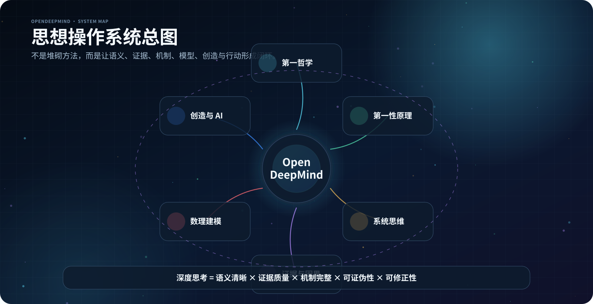
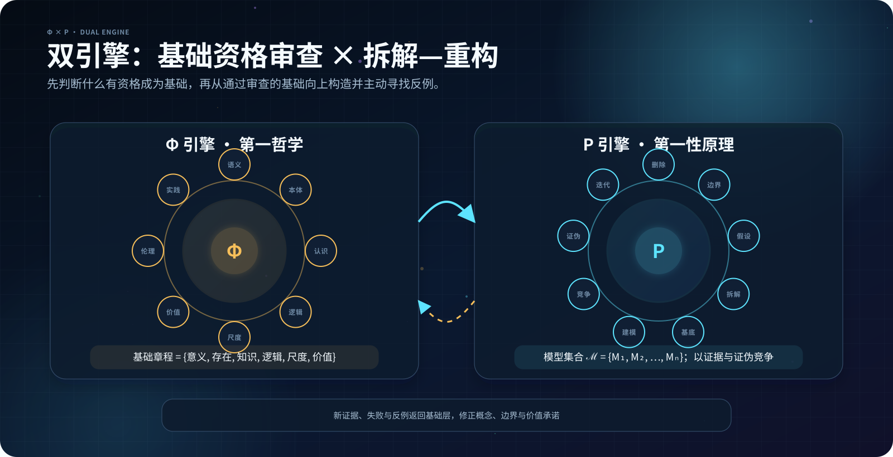
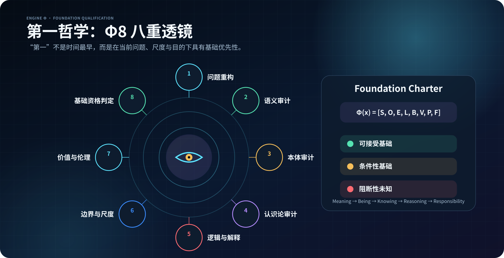
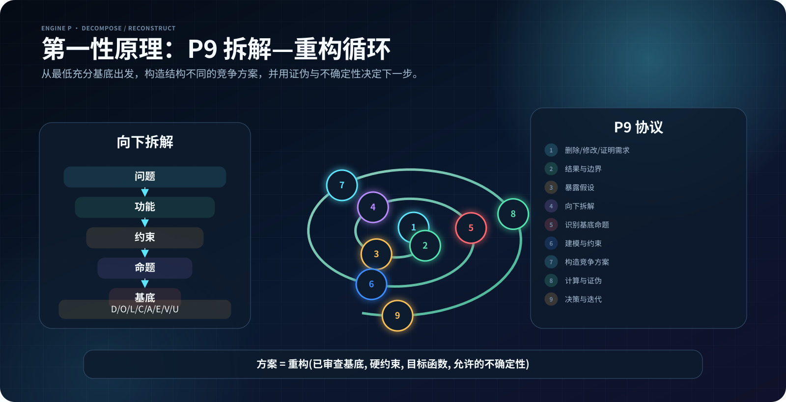
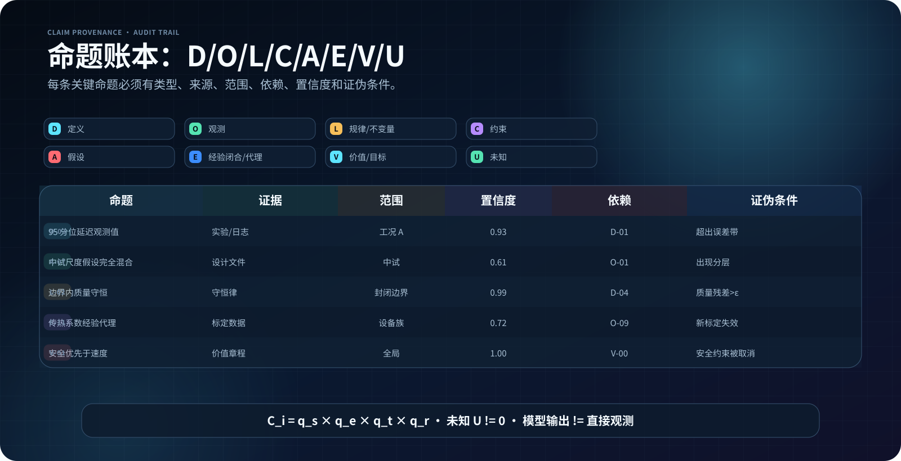
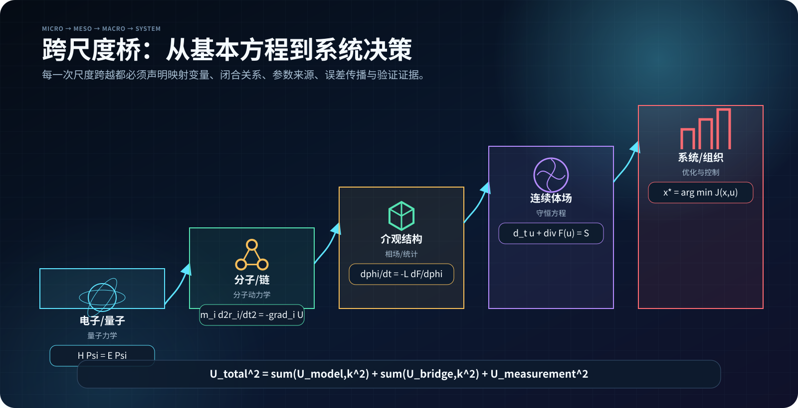
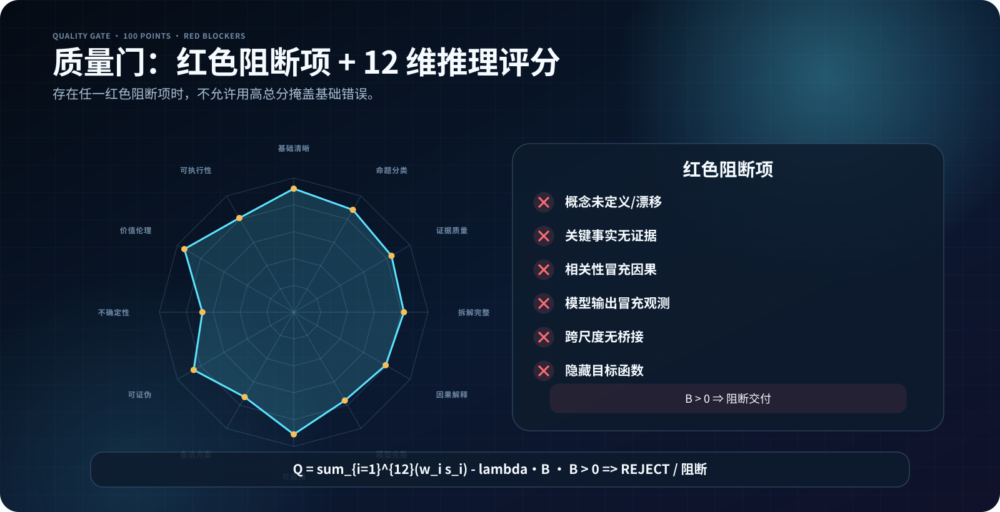

<p align="center">
  
</p>
<p align="center"><sub>中文 AI 设计总览：第一哲学 × 第一性原理 × 竞争模型 × 跨尺度建模 × 质量门 × 行动迭代。</sub></p>

<h1 align="center">OpenDeepMind_skill</h1>

<p align="center"><b>不要急于优化继承而来的问题框架。<br>先审查什么有资格成为基础，再从基础向上推导、证伪、决策，并保留修正能力。</b></p>

<p align="center">
  <a href="README.md">English</a> ·
  <a href="open-deep-mind/SKILL.md">主 Skill</a> ·
  <a href="open-deep-mind/FIRST_PHILOSOPHY.md">第一哲学</a> ·
  <a href="open-deep-mind/FIRST_PRINCIPLES.md">第一性原理</a>
</p>

<p align="center">
  
  
  
  
  
  
</p>

> **独立项目声明：**OpenDeepMind_skill 与 Google DeepMind 无隶属、合作或背书关系。仓库名称表达的是一种开放、深度、可审计的思维方法。

> **视觉语言约定：**本中文 README 使用八张纯中文 AI 设计 SVG，数理公式采用确定性排版；英文 README 使用另一套纯英文图，单张图内不混用中英文标签。

---

## 为什么需要这个仓库

很多所谓“第一性原理分析”开始得太晚：它们直接拆解问题，却没有先检查：

- 问题是否被正确提出；
- 核心概念是否在前后保持同一含义；
- 所谓“事实”是否其实是假设、经验闭合关系或价值判断；
- 所谓“因果”是否只是相关性或叙述性标签；
- 结论是否在没有尺度桥的情况下从微观跳到宏观；
- 所谓“最优”究竟替谁优化、牺牲了谁、隐含什么权重。

OpenDeepMind 在第一性原理之前增加一道基础资格审查：

\[
\boxed{
\text{第一哲学}
\rightarrow
\text{第一性原理}
\rightarrow
\text{竞争模型}
\rightarrow
\text{质量门}
\rightarrow
\text{行动与修正}
}
\]

它不是哲学知识百科，也不是任意发散的头脑风暴工具，而是一套把复杂问题转化为以下成果的通用程序：

- 类型明确的命题；
- 可说明的基础；
- 可比较的模型；
- 可证伪的推导；
- 可执行、可监测、可复审的决策。

<p align="center">
  
</p>

<p align="center"><sub>中文本地化 AI 设计图。图中的中文标签与数理公式采用确定性排版，保证可读与准确；构图表达方法体系，而不是正式文件树。</sub></p>

---

## 双引擎架构

<p align="center">
  
</p>

### Φ 引擎：第一哲学

第一哲学首先追问：

> **在这个问题中，什么有资格成为基础？**

它从八个方向审查基础：

\[
\mathcal F_{\Phi}
=
\{\text{语义},\text{本体},\text{认识},\text{逻辑},
\text{因果},\text{边界},\text{价值},\text{实践}\}
\]

输出不是抽象议论，而是一份可交接给第一性原理引擎的 **《基础章程》**，其中包括：

- 关键概念及操作性定义；
- 对象、过程、关系、属性和缺失项的本体图；
- 观测、推断、模型输出、证言、价值判断的认识状态；
- 逻辑结构与因果/解释承诺；
- 系统边界、尺度、时间和适用范围；
- 目标、义务、利益相关者与分配问题；
- 仍然成立的竞争框架与阻断项。

<p align="center">
  
</p>

独立文件：

[`open-deep-mind/FIRST_PHILOSOPHY.md`](open-deep-mind/FIRST_PHILOSOPHY.md)

其中把概念分析、亚里士多德式解释、笛卡尔方法怀疑、康德式可能性条件、现象学还原、解释学循环、伦理优先审查和自然化/实用主义审查封装为可执行步骤。

### P 引擎：第一性原理

第一性原理进一步追问：

> **在明确的领域、尺度、目的和条件下，从已经通过审查的基础能够推出什么？**

P9 流程包括：

1. 删除或证明需求合理；
2. 定义真正结果与系统边界；
3. 暴露并分类所有假设；
4. 沿依赖关系向下拆解；
5. 审查候选基底命题；
6. 建立约束、因果、动态或数理模型；
7. 从基础向上构造不同方案；
8. 推导、计算、竞争模型和证伪；
9. 决策、监测、触发复审与更新。

<p align="center">
  
</p>

独立文件：

[`open-deep-mind/FIRST_PRINCIPLES.md`](open-deep-mind/FIRST_PRINCIPLES.md)

第一哲学与第一性原理必须分开，是为了同时避免两种错误：

- 把某一层级的物理理论当成所有哲学、社会与价值问题的答案；
- 无限讨论基础，却不形成可检验模型和可执行结论。

---

## 命题账本

OpenDeepMind 不允许不同类型的命题互相借用权威。

<p align="center">
  
</p>

| 编码 | 类型 | 含义 |
|---|---|---|
| `D` | 定义 | 约定、词汇、操作性或理论定义 |
| `O` | 观测 | 测量、记录、直接来源 |
| `L` | 规律/不变量 | 在指定领域得到独立支持的规律 |
| `C` | 约束 | 物理、逻辑、法律、伦理或经核验的资源边界 |
| `A` | 假设 | 尚未作为事实确立、需要检验或敏感性审查的前提 |
| `E` | 经验闭合/估计 | 拟合、代理、启发式、本构关系或学习型近似 |
| `V` | 价值 | 目标、义务、偏好、效用与风险容忍度 |
| `U` | 未知 | 足以改变决策的未解决问题 |

每项关键命题还要记录：

```text
状态 · 适用范围 · 来源 · 依赖 · 置信度 · 证伪条件 · 责任人 · 复审日期
```

模板：

- [`claim-ledger-template.md`](open-deep-mind/assets/claim-ledger-template.md)
- [`claim-ledger.schema.json`](open-deep-mind/assets/claim-ledger.schema.json)
- [`example-ledger.json`](open-deep-mind/assets/example-ledger.json)

---

## “第一”必须说明相对于哪个层级

某个原理可以是一个模型的基础，同时又是另一套更低层理论的推导结果。

<p align="center">
  
</p>

跨尺度箭头必须付出方法学成本：

\[
\text{低尺度状态}
\xrightarrow[\text{不确定性}]{\text{映射 + 闭合}}
\text{有效变量}
\xrightarrow[\text{验证}]{\text{高尺度模型}}
\text{可观测结果}
\]

每个尺度桥都必须说明：

- 映射变量；
- 闭合、粗粒化或同质化假设；
- 丢失的信息；
- 参数与标定来源；
- 不确定性如何传播；
- 在什么范围内验证；
- 在何种条件下失效。

因此，这一 Skill 可以同时服务于概念研究、形式证明、因果推断、科学计算、工程设计、战略和政策，却不会假装它们拥有完全相同的证据标准。

---

## 领域路由

| 领域 | 默认重点 |
|---|---|
| 科学与科研 | 测量、机制、竞争模型、前瞻预测与判别实验 |
| 工程与软件 | 功能、硬约束、故障、运维、可逆性 |
| 数理与计算 | 控制方程、闭合关系、参数、初边值、收敛与不确定性 |
| 商业与战略 | 价值机制、经济性、竞争者响应、实物期权 |
| 政策、法律与伦理 | 权限、权利、证据、分配、申诉与退出机制 |
| 个人决策 | 价值、真实行为、可逆试验、复审触发器 |
| 创意与产品创新 | 张力、矛盾、结构性新颖、效用与价值验证 |

完整路由表：

[`domain-routing.md`](open-deep-mind/references/domain-routing.md)

跨领域总规则：

> **同时涉及多个领域时，采用其中最严格的证据、安全和伦理标准。**

---

## 选择方法，而不是堆砌方法

[`method-atlas.md`](open-deep-mind/references/method-atlas.md) 包含三十余张可执行方法卡，分为：

- 基础审查方法；
- 结构拆解方法；
- 构造与创新方法；
- 对抗与反证方法；
- 校准与验证方法。

复杂问题的默认组合为：

\[
\text{概念/本体审查}
+
\text{因果或机制图}
+
\text{形态学构造}
+
\text{逆向攻击}
+
\text{证据校准}
\]

只有明确指出“当前最弱环节是什么”之后，才能切换方法。用不同措辞重复同一观点，不属于递归优化。

---

## 质量门

<p align="center">
  
</p>

### 第一层：红色阻断项

包括但不限于：

- 核心术语未定义或前后变义；
- 关键事实无可靠来源；
- 结论在逻辑上并不由前提推出；
- 把相关性写成因果性；
- 隐藏目标函数和利益相关者；
- 未建立尺度桥就跨尺度下结论；
- 没有证伪条件或严肃竞争模型；
- 未核验就删除法律、安全或伦理保护；
- 虚构文献、数据、实验、引文或共识。

存在任何红色阻断项时，不得用高分掩盖，也不得把结果称为“最终验证完成”。

### 第二层：100 分推理质量

十二个加权维度：

- 基础清晰度；
- 命题分类；
- 证据质量；
- 拆解完整性；
- 因果/解释充分性；
- 模型完整性；
- 可追溯性；
- 替代方案；
- 可证伪性；
- 不确定性与鲁棒性；
- 价值与伦理；
- 可执行性。

| 模式 | 最低分 | 附加条件 |
|---|---:|---|
| 快速 | 70 | 可逆决策且无红色阻断 |
| 标准 | 80 | 无红色阻断且有一个强竞争模型 |
| 深度 | 88 | 完成来源和不确定性审计 |
| 科研/高风险 | 90 | 按情形增加可复现或专业核验 |

完整标准：

[`quality-gates.md`](open-deep-mind/references/quality-gates.md)

---

## 错误雷达

系统主动检测：

- 范畴错误与实体化；
- 偷换概念、虚假二分和循环论证；
- 引文表演与来源洗白；
- 相关性—因果性错误；
- 用“协同、涌现、AI”等词替代机制；
- 把模型输出写成直接观测；
- 微观结果直接跳到宏观结论；
- 方程装饰与伪精确；
- 代理指标优化；
- 隐藏价值；
- 删除崇拜；
- 忽略不可逆风险与责任主体。

完整诊断表：

[`failure-modes.md`](open-deep-mind/references/failure-modes.md)

---

## 输出体系

内置输出模板包括：

- 《基础章程》；
- 《第一性原理决策备忘录》；
- 《双引擎完整分析》；
- 《科学机制审计》；
- 《工程架构评审》；
- 《战略/政策备忘录》；
- 快速分析；
- 质量与收敛附录。

模板文件：

[`output-templates.md`](open-deep-mind/assets/output-templates.md)

任何重要输出最终都必须给出：

```text
结论或决策：
为什么：
基础追溯：
关键假设：
不确定性：
什么结果会改变结论：
下一项最有判别力的行动：
何时触发复审：
```

---

## 仓库结构

```text
OpenDeepMind_skill/
├── README.md
├── README.zh-CN.md
├── AGENTS.md
├── CONTRIBUTING.md
├── CHANGELOG.md
├── LICENSE.md
├── NOTICE.md
├── .github/workflows/validate.yml
└── open-deep-mind/
    ├── SKILL.md
    ├── FIRST_PHILOSOPHY.md
    ├── FIRST_PRINCIPLES.md
    ├── references/
    │   ├── method-atlas.md
    │   ├── domain-routing.md
    │   ├── quality-gates.md
    │   ├── failure-modes.md
    │   ├── intellectual-lineage.md
    │   ├── glossary.md
    │   └── worked-examples.md
    ├── assets/
    │   ├── output-templates.md
    │   ├── claim-ledger-template.md
    │   ├── claim-ledger.schema.json
    │   ├── example-ledger.json
    │   └── diagrams/
    │       ├── zh/                 # 8 张中文 AI 设计、公式化 SVG 示意图
    │       └── en/                 # 8 张英文 AI 设计、公式化 SVG 示意图
    └── scripts/
        ├── validate_repository.py
        └── validate_ledger.py
```

主 `SKILL.md` 只负责触发、路由、总流程和强制规则；详细内容按需加载，以减少上下文浪费。

---

## 安装

### Skills CLI

```bash
npx skills add SUNHAOJUN22/OpenDeepMind_skill --skill open-deep-mind
```

### 手动安装

```bash
git clone https://github.com/SUNHAOJUN22/OpenDeepMind_skill.git
```

将 `open-deep-mind/` 复制到目标智能体支持的 Skills 目录。常见项目级目录包括：

```text
.codex/skills/
.claude/skills/
.cursor/skills/
.github/skills/
.gemini/skills/
.agent/skills/
```

不同客户端的目录约定可能更新，应以目标客户端当前文档为准。

### 直接调用

```text
读取 open-deep-mind/SKILL.md。
使用“第一哲学 → 第一性原理”双引擎深度模式分析本问题。
先生成基础章程，再建立命题账本、竞争模型和质量门。
最后给出结论、基础追溯、不确定性、证伪条件、下一判别行动和复审触发器。
```

---

## 示例 Prompt

```text
调用 OpenDeepMind 第一哲学模式。
审查“智能”“理解”“机制”在本文中的定义、本体地位和证据标准，
并给出至少两个竞争框架。
```

```text
调用 OpenDeepMind 第一性原理模式。
不要直接接受现有需求；先做删除测试，再把所有命题分成 D/O/L/C/A/E/V/U，
从通过审查的基础向上重建三个结构不同的方案。
```

```text
调用 OpenDeepMind 双引擎审查这项科研机制结论。
区分直接证据、间接证据、模型输出、经验闭合、假设与未知；
列出全部尺度桥、竞争机制、判别实验和质量分数。
```

```text
从第一哲学和第一性原理重新设计这项战略。
包含零行动基线、竞争者响应、价值分配、阶段性承诺、退出条件和证伪触发器。
```

跨领域示例：

[`worked-examples.md`](open-deep-mind/references/worked-examples.md)

---

## 自动验证

核心验证不依赖第三方 Python 包。

```bash
python open-deep-mind/scripts/validate_repository.py .
python open-deep-mind/scripts/validate_ledger.py \
  open-deep-mind/assets/example-ledger.json
```

自动检查：

- Agent Skills frontmatter；
- 第一哲学与第一性原理是否保持为两个独立核心文件；
- Markdown 相对链接；
- JSON 合法性；
- SVG XML 合法性；
- Python 语法；
- 未解决占位词；
- README 视觉资产是否完整。

GitHub Actions 会在 push 与 pull request 上运行同样检查。

---

## 十条设计原则

1. 基础先于方案。
2. “第一”必须说明相对领域、尺度与目的。
3. 先给命题分类，再允许推理。
4. 机制和约束优先于概念标签。
5. 推荐之前必须有结构不同的替代方案。
6. 置信度之前必须有证伪条件。
7. 优化之前必须显式给出价值与责任。
8. 跨尺度结论之前必须建立尺度桥。
9. 行动必须包含监测和复审触发器。
10. 采用渐进式披露，不用信息堆砌制造深度假象。

---

## 思想来源与致谢

思想谱系和技术来源见：

[`intellectual-lineage.md`](open-deep-mind/references/intellectual-lineage.md)

仓库结构设计受到以下项目启发：

- MIT 许可的 `danyuchn/first-principles-skill`：尤其是显式的需求删除阶段；
- CC BY 4.0 许可的 `smixs/creative-director-skill`：尤其是阶段路由、方法选择、递归评价、输出纪律与强视觉 README；
- 开放的 Agent Skills 规范。

OpenDeepMind 的双引擎架构、基础章程、命题账本、严格度阶梯、尺度桥审计、质量体系、图形、脚本、案例和正文均为重新创作。详细署名见 [`NOTICE.md`](NOTICE.md)。

---

## 许可

- 代码、脚本、Schema 与工作流：Apache-2.0；
- 方法论、文档与视觉资产：CC BY 4.0。

详见 [`LICENSE.md`](LICENSE.md)。

---

## 当前状态

**Version 1.0.0 — 通用思想方法初始完整版本。**

未来版本只有在明确记录以下内容后，才应改变核心规则：

- 哪项假设失效；
- 哪项证据或案例暴露了问题；
- 修改了什么方法；
- 预期改善什么；
- 对兼容性有什么影响。
