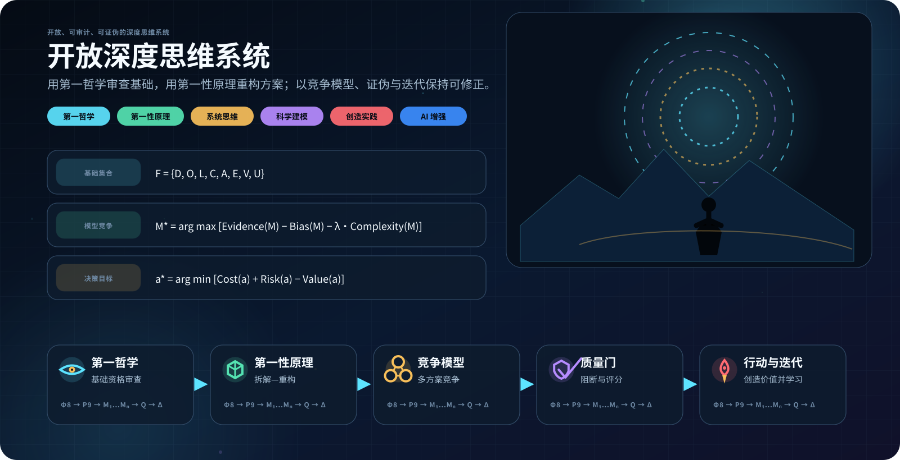

<p align="center">
  
</p>

<h1 align="center">OpenDeepMind_skill</h1>

<p align="center">
  <strong>第一哲学审查基础，第一性原理负责重构；TRIZ 仅在明确调用时进入工程发明路线。</strong>
</p>

<p align="center">
  <a href="README.md">中英双语首页</a> ·
  <a href="open-deep-mind/SKILL.md">主路由</a> ·
  <a href="open-deep-mind/ARCHITECTURE.md">模块架构</a> ·
  <a href="open-deep-mind/first-philosophy/METHOD.md">第一哲学</a> ·
  <a href="open-deep-mind/first-principles/METHOD.md">第一性原理</a> ·
  <a href="open-deep-mind/triz/ROUTER.md">TRIZ 路由</a> ·
  <a href="open-deep-mind/triz/README.md">完整 TRIZ</a>
</p>

<p align="center">
  
  
  
  
  
</p>

---

## 1. 1.2.0 的核心变化：真正隔离三个模块

OpenDeepMind 不再把第一哲学、第一性原理、TRIZ 的方法正文混在根目录文件里。

```text
open-deep-mind/
├── SKILL.md                       # 仅负责路由
├── ARCHITECTURE.md                # 模块边界与交接协议
├── MODULES.json                   # 机器可读模块注册表
│
├── first-philosophy/
│   ├── METHOD.md                  # Φ8 正式方法体
│   ├── module.json
│   ├── foundation-charter.schema.json
│   └── scripts/validate_module.py
│
├── first-principles/
│   ├── METHOD.md                  # P9 正式方法体
│   ├── module.json
│   ├── model-contract.schema.json
│   ├── decision-record.schema.json
│   └── scripts/validate_module.py
│
└── triz/
    ├── ROUTER.md                  # T10，明确调用才进入
    ├── module.json
    ├── resources/
    ├── examples/
    └── scripts/
```

旧的：

```text
FIRST_PHILOSOPHY.md
FIRST_PRINCIPLES.md
TRIZ_ENGINEERING.md
```

现在只作为兼容入口，避免旧链接失效，不再承载正式方法正文。

---

## 2. 第一哲学 Φ：基础资格审查

正式方法：[`first-philosophy/METHOD.md`](open-deep-mind/first-philosophy/METHOD.md)

第一哲学不是提前给方案，而是先问：

> **什么必须先被澄清、接受或证明，当前问题才算一个成立的问题，后续结论才有资格成立？**

Φ8 现在严格定义为八阶段：

```text
Φ0 暂停继承的问题框架
Φ1 语义审计
Φ2 本体审计
Φ3 认识论审计
Φ4 逻辑审计
Φ5 因果与解释审计
Φ6 边界、尺度与时间审计
Φ7 价值、伦理与实践审计
```

输出是《Foundation Charter / 基础章程》，包括：

- 中性问题与竞争框架；
- 定义；
- 对象、过程和关系；
- 证据状态；
- 逻辑、因果与解释承诺；
- 系统边界、尺度与时间；
- 价值、义务与利益相关者；
- 已接受、条件接受、拒绝的基础；
- 阻断性未知项。

该模块**绝不加载 TRIZ**。

---

## 3. 第一性原理 P：拆解、建模、重构、证伪、决策

正式方法：[`first-principles/METHOD.md`](open-deep-mind/first-principles/METHOD.md)

此前仓库把流程称为 P9，却实际写成 P0–P9 共 10 个步骤；1.2.0 已完成结构纠正。现在真正是：

```text
P1 删除、修改或证明需求合理
P2 定义真实结果与边界
P3 暴露假设并给命题分类
P4 向下拆解至可接受基础
P5 对基础做资格审查
P6 建立模型
P7 从基础向上构造不同方案
P8 推导、追溯、证伪与压力测试
P9 决策、行动、监测与更新
```

### 命题账本

\[
\mathcal B=\{D,O,L,C,A,E,V,U\}
\]

分别对应定义、观测、规律、约束、假设、经验闭合、价值和未知。

### 模型契约

定量工作至少明确适用的：

\[
\mathcal M=
\{\mathbf x,\mathbf u,\boldsymbol\theta,
\mathbf F,\mathbf h,\mathbf g,
\mathrm{IC},\mathrm{BC},\mathcal O,\mathcal E\}
\]

并声明参数来源、闭合关系、初边值、观测模型、误差/模型偏差、适用域、敏感性与证伪条件。

机器可读契约：

- [`model-contract.schema.json`](open-deep-mind/first-principles/model-contract.schema.json)
- [`decision-record.schema.json`](open-deep-mind/first-principles/decision-record.schema.json)

该方法体**不包含 TRIZ 流程，也不会自动加载 TRIZ**。

---

## 4. TRIZ T：完整、独立、显式调用的工程发明子系统

正式路由：[`triz/ROUTER.md`](open-deep-mind/triz/ROUTER.md)  
完整地图：[`triz/README.md`](open-deep-mind/triz/README.md)

TRIZ 不是第三个基础哲学引擎，而是专业工程发明模块。只有用户明确要求或明确接受 TRIZ 路线时才运行。

T10 现在统一为真正的十阶段：

```text
T1 确认显式调用与工程作用域
T2 识别关键工程问题
T3 资源、理想性与 IFR
T4 建立问题模型
T5 选择求解路线
T6 构造结构不同的概念族
T7 把 TRIZ 抽象规则翻译为具体工程机制
T8 物理、安全、材料、制造等硬门筛选
T9 设计最小判别验证
T10 返回第一性原理验证
```

完整 TRIZ 子系统包括：

- 功能分析、流分析、CECA、裁剪、特征迁移；
- 创新标杆；
- Nine Windows、STC、Smart Little People；
- Ideality、IFR 与资源；
- 技术矛盾、物理矛盾；
- 39 参数、40 发明原理；
- 完整 39×39 矛盾矩阵转录，1190 个非空单元；
- 分离原则；
- Su-Field；
- 76 个标准发明解；
- ARIZ-85C；
- Clone Problems、科学效应与 FOS；
- S 曲线和 TESE；
- 概念论证、验证路线与案例；
- 矩阵与标准解确定性查询脚本。

### 数据完整性

矩阵保留来源转录版本，而不是把历史转录数据悄悄改掉。已知异常独立登记在：

[`matrix_anomalies.json`](open-deep-mind/triz/resources/matrix_anomalies.json)

查询脚本同时返回原始值和规范化后的实际使用值。

### TRIZ 不能替代工程证明

所有 TRIZ 概念必须返回第一性原理：

```text
TRIZ 概念
→ 控制方程/基本物理
→ 材料与制造
→ 参数与数据来源
→ 不确定性与敏感性
→ 安全、法规与寿命
→ 仿真/实验/原型
→ 竞争模型与证伪
```

---

## 5. 共享质量门

共享质量体系：[`quality-gates.md`](open-deep-mind/references/quality-gates.md)

任何一个红色阻断项都不能被“高分”覆盖，包括：

- 核心术语漂移；
- 关键事实无可靠依据；
- 推导不成立；
- 相关写成因果；
- 模型输出写成直接观测；
- 跨尺度无桥接；
- 参数/闭合/边界来源不明；
- 没有强竞争模型或证伪条件；
- 价值函数隐藏；
- 未核实就删除安全/法律/伦理保护；
- 虚构文献、数据或实验。

---

## 6. 自动验证

```bash
python open-deep-mind/scripts/validate_repository.py .
python open-deep-mind/scripts/validate_ledger.py open-deep-mind/assets/example-ledger.json
python open-deep-mind/first-philosophy/scripts/validate_module.py
python open-deep-mind/first-principles/scripts/validate_module.py
python open-deep-mind/triz/scripts/validate_triz_module.py
python open-deep-mind/triz/scripts/lookup_matrix.py --improve 1 --worsen 3 --json
python open-deep-mind/triz/scripts/lookup_standard_solution.py 1.2.1 --json
python -m unittest discover -s open-deep-mind/tests -p "test_*.py"
python -m compileall -q open-deep-mind
```

验证对象不仅包括语法，还包括：

- VERSION 与模块版本一致性；
- Φ8 / P9 / T10 编号不漂移；
- 模块 manifest 与 canonical entry；
- TRIZ explicit-only；
- 兼容入口必须保持薄；
- Markdown/HTML 本地链接；
- 命题依赖图无循环；
- 39 参数、40 原理；
- 矩阵 1190 单元和锚点；
- 已知矩阵异常必须登记；
- 76 标准解数量及五类分布；
- ARIZ 九部分；
- 确定性查询工具；
- 回归测试。

---

## 7. 调用方式

### 第一哲学

```text
调用 OpenDeepMind 第一哲学 Φ8，只做基础资格审查并输出基础章程；不要调用 TRIZ。
```

### 第一性原理

```text
调用 OpenDeepMind 第一性原理 P9，从合格基础建立命题账本、模型契约、竞争方案、证伪条件和决策记录；不要调用 TRIZ。
```

### TRIZ

```text
明确调用 OpenDeepMind TRIZ：先完成必要的 Φ/P 资格审查，再按 T1–T10 使用适用的矩阵、40原理、分离、Su-Field/76标准解、ARIZ、FOS/效应或 TESE，最后必须返回 P 做物理和证据验证。
```

---

## 8. 完备性的准确含义

本仓库所说的“完备”是**工程化方法包完备**：每个模块都有正式入口、清单、输入输出契约、停止条件、实例/fixture、独立验证器、依赖边界、来源/许可与 CI。

它不意味着：

- 一份文件穷尽全部哲学；
- 所有学科都共享同一证据标准；
- 所有 TRIZ 书籍、专利和科学效应都静态复制进仓库；
- 第一性原理计算没有近似；
- 通过代码校验就等于现实世界的结论已经被实验验证。

仓库追求的是：

\[
\boxed{边界明确+推理可追溯+失败可检验+结论可修正}
\]

来源、归因与许可详见 [`NOTICE.md`](NOTICE.md)、[`LICENSE.md`](LICENSE.md) 和 [`triz/resources/sources.md`](open-deep-mind/triz/resources/sources.md)。
